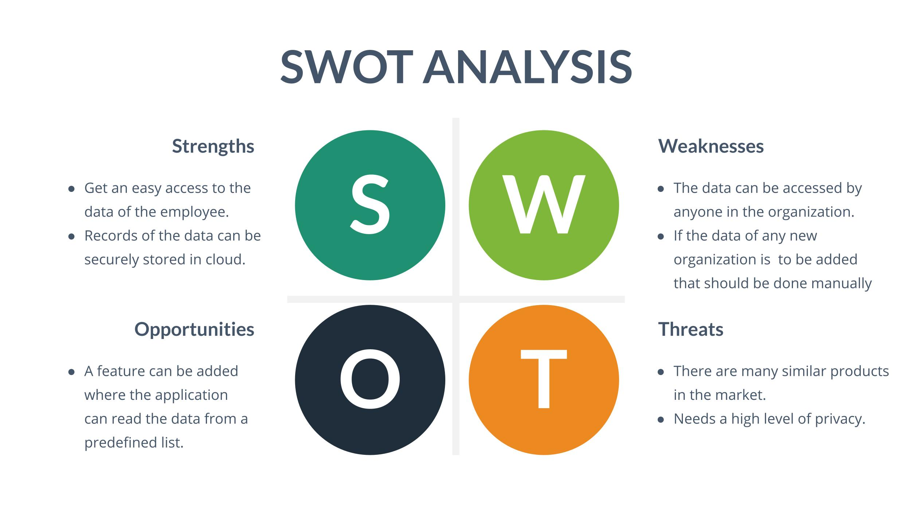

# REQIUREMENTS:
## Introduction:
An emplpoyee management system is an application where all the data related to an employee working in the respective organization are stored and managed securly. By using this aplication you can access the information about any employee in an easier and a quiker way.
## Major challenges in employee management:
In any company the workforce is one of the major factors of success. So, you must invest in your staff and serve them better employee experience. Below mentioned are some of the biggest challenges in staff management that employers need to be ready to tackle:
* Difficult to trace and record staff 
data.
* Changes to the data whenever needed.
* Search for an employeeS.
## Benefits:
* It's a ready source of information:
Employee Management System performs as a readily available source of information between the organization and the employee. 
* Highly efficient system:
A member of the organization can easily retrieve information about his/her colleague whenever required, and that too on short notice.
* Reliable Accuracy:
Since the information is mostly fed in by the employees themselves you can be sure the information is accurate since it’s straight from the source. Moreover, an employee can access their information at any time. Therefore, he/she can keep it updated and correct mistakes, if any.
* Updated data:
The information added to the employee management system can be available for as long as an employee is working in a firm or if needed, longer than that. Also, if at any point in time, the employee data changes the employee themselves can make the alterations. As a result, obsolete data is a rare find on such systems.
* Confidentiality:
Specific information about the employee can not only be set to be kept private from public viewing but can also be set to be kept private from anyone other than the admin of the software or the head of the organization.
## 4 W'S and 1'H:
### WHO:
* In any organization the data of their employee can be accessed.
### WHAT:
* Getting personal details such as designation,age, emplyee Id and salary of an employee can be done in an easier way by using this management tool.
### WHERE:
* Any organization having a huge number of employee data which become difficult to handle can use this application.
### WHEN:
* In order to get any immediate information about an particular employee. 
### HOW:
* The information can be accessed by giving the respective Employee Id as an input. We can add,delete,sort and search for the data at any time.
## SWOT Analysis:

## DETAIL REQUIREMENTS:
### High Level Requirement:

|ID|Description|Category|Status|
|--|-----------|--------|------|
|HR01|User will be able build a employee record|Technical|Implemented|
|HR02|User will be able to diplay the list of records|Technical|Implemented|
|HR03|User will be able to insert a new record in to the list|Technical|Implemented|
|HR04|User will be able to delete a record from the list|Technical|Implemented|
|HR05|User will be able to search for employee details|Technical|Implemented|
|HR06|Employee data loss in case of any failures|Scenario|Implemented|
|HR07|Privacy for the data to access|Technical|Future|
|HR08|User will be able to sort the data|Technical|Implemented|
|HR09|User will be able to update the records|Technical|Implemented|
|HR10|Error message when entered data with same employee ID|Technical|Future|

### Low Level Requirement:

|ID|Description|Category|Status|
|--|-----------|--------|------|
|LR01|User need to access the data using the employee ID for deleting or updating the records in the list|Technical|Implemented|
|LR02|In case of appending multiple records with same employee ID and displaying an error message|Technical|Future|
|LR03|User can sort the records using experience and employee ID|Technical|Implemented|
|LR04|User will be to save and read the records from the files|Technical|Implemented|

